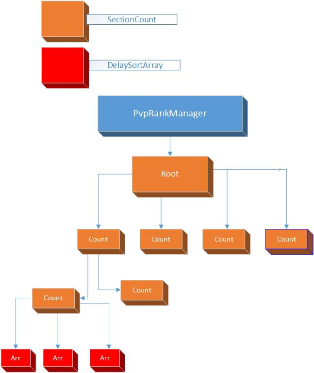

##pvp排行榜服设计
	auth : diandian
	date : 2016.5.7

## 概述

排行榜核心思想是采用分段排名的方式做排名排序，然后将每个段的数据做一个特殊的缓存然后定时排序的方式来做到顺序

## 代码和设计

* 用c++开发so库，节省内存。代码位置`fgamesvr/luaclib-src/pvp_rank`

* 代码类结构：
  1 ， `SectionCount`: 二叉树计数结构，将积分分成各个段的树形结构然后对每个段的每层结构都做一个计数的缓存，这样可以快速拿到当前积分段之前的排名有多少。

  2， `DelaySortArray`: 单个分段的排名数据封装，插入和删除操作都是改变一个hashmap的容器，然后定时将hashmap的所有key取出放入数组做一次排序，然后将序号做value存入hashmap

  3， `PvpRankManager`: 将1，2的结构组合起来形成一个完整的排行榜结构，并保存玩家的详细数据。

* 多核利用：
  1 ， skynet的多核利用方法就是将任务分配到多个服务，结合pvp积分排名分组之间的排名互不干扰的规则下，将单个组的排名数据放在一个服务里面，这样就可以起四个服务，每个服务的c层都拥有自己的PvpRankManager对象。组服务名字:`pvp_rank_group_service`

  2， 由于每个gamed可能并不知道玩家具体在那个积分分组，所有需要排行服需要一个服务接受查询和插入请求并转发到相应的组的服。插入请求由于是不需要返回的所以用send方式发送到组服务。转发服务名字: `pvp_rank_service`

* gamed排名数据缓存机制：

  1 ，` 前50名缓存策略` : 由于前50名是全服公共数据，所有每个gamed可以都缓存一份，但是如果大家同步的时间不同可能会造成不同gamed之间的玩家看到的数据不一样的问题，解决方案是每个gamed的缓存数据都有一个时效，时效过了就会去排行服重新获取。只要失效间隔控制在几秒内，几秒内看到不一样这种体验是可以接受的。

  2，`玩家自己前后10名玩家数据`: 这个数据缓存再每个玩家自己的agent里面，并设置一个时效，失效过了就重新去排行服请求，只要时效小于正常打一场pvp的时间，玩家并不会看到数据没有更新的问题。

