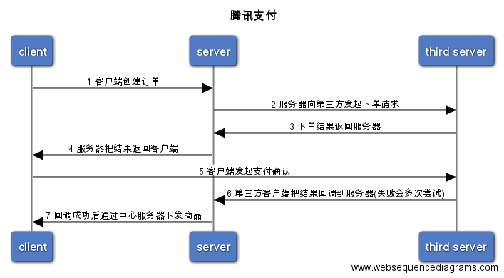

# 支付说明


> 为了更好的维护这块代码，所以出示文档说明,线上代码部署在`/data/fgame/www_9001`目录


#### 1. 支付流程图

```raw

title 腾讯支付

client->server: 1 客户端创建订单
server->third server: 2 服务器向第三方发起下单请求
third server -> server: 3 下单结果返回服务器
server->client: 4 服务器把结果返回客户端
client->third server: 5 客户端发起支付确认
third server->server: 6 第三方客户端把结果回调到服务器(失败会多次尝试)
server->client: 7 回调成功后通过中心服务器下发商品
```




**说明**

client是游戏客户端
server是指php服务端
third server是指第三方支付平台


#### 2. 目录结构

> 以腾讯(midas)为例

midas/
|├── callback.php
├── config.php
├── createorder.php
├── getsign.php
└── lib
    ├── OpenApiV3.php
    ├── SnsNetwork.php
    ├── SnsSigCheck.php
    └── SnsStat.php
utils/
├── configbak.php
├── config.php
├── logger.php
├── logger_test.php
├── order_factory.php
├── order.php
├── redis.php
├── redis_test2.php
├── redis_test.php
├── rsa.php
├── simple_log.php
└── util.php

midas目录是包含创建订单和回调两个功能
utils目录是些公共功能如日志、redis及公共配置等


#### 3. 配置说明

> 配置目录在`/data/fgame/www_9001/utils/config.php`

```php

return array(
    'center' => 'http://127.0.0.1:8602', //通知中心服务器的地址
    'qqcenter' => 'http://10.105.112.32:8602', //qq的中心服务地址
    'wxcenter' => 'http://10.105.112.32:8602', //wx的中心服务地址
    'testcenter' => 'http://10.105.98.107:8602', //提审测试的中心服务地址
    'lenovocenter' => 'http://10.105.86.119:8602',
    "logger" => '/data/fgame/www_9001/order/order.log', //记录所有充值成功的日志
    "logiclog" => '/data/fgame/www_9001/log/logic.log', //记录程序逻辑错误日志
    "mysql"  => array(
                        "host" => "10.105.98.107",
                        "user" => "root",
                        "auth" => "61@games",
                        "db"   => "oss_qq"),
    "redis"  => array(
                    "host" => "10.66.125.63",
                    "port" => "6379",
                    "user" => "root",
                    "auth" => "crs-8vg42ila:MeiweiZZ0321",
                    "timeout" => 10),
```

<font color=red> 已经上线的只需要关注这个配置就好了，且有修改一定要注意这里的配置</font>

**说明:**

*center的配置是通知游戏服下发玩家商品的中心服，因为线上有不同的平台所以需要区分
logger配置是对应所有回调成功(通知中心服务成功)的订单日志记录文件
logiclog配置对应程序逻辑错误日志
mysql 是记录日志服务的地址
redis 是线上redis地址


#### 3. 日志查看

支付相关只会产生两种日志

- 程序逻辑错误
    程序中产生的逻辑日志会写到logiclog配置下面

- php代码异常错误

    php代码异常的日志会写到`/data/fgame/php5.6/var/log/fpm-php.www.log`

- 成功订单
    成功订单我们写在上面配置文件的logger文件下，只记录成功的订单! 失败的同样写在上面的文件里

<font color=red>成功和失败的订单同样会写到上面mysql配置的数据库里，这里更方便查询</font>


#### 4. help

重启php
`service php-fpm restart`

redis测试

可以用这个来测试线上redis连接是否正常

`http://115.159.188.208:9001/utils/redis_test.php`

{"Money":5510,"Status":"success","ExtOrderId":"-APPDJ54659-20160630-1851073953","PayTime":1467283877,"Time":1467283877,"Uin":10002914,"ShopId":17}

输出指定订单的信息


# gm&gm授权

> 因为gm接口是内部用来操作运营的功能，所以对外需要经过授权才可以通过,gm部署在`/data/fgame/www_9101`目录下

#### 1. gm

> 线上部署在`/data/fgame/www_9101/gm`目录

gm是一个内部的一个系统，只是为了方便查询redis里面的二进制数据,因为是对外的内部小系统，需要注册用户。

##### 1.1 准备

因为需要登录，我们代码设计是从数据库里面读的，所以需要在mysql里创建对应的数据库和表，目录下面有个gm.sql脚本，需要把脚本运行到对应数据库。

`add_user.sh [user] [pass]`来添加用户

##### 1.2 配置说明

> 文件地址`/data/fgame/www_9101/gm/config.php`

```php

$gmToken = '127.0.0.1:9101/token/magic.php?';

$mysql = array(
    'host' => '10.66.140.49:3306',
    'user' => 'root',
    'pass' => 'MeiweiZZ0321',
    'db'   => 'dev_user',
);

```

部署时这两个地址记得要做改变!!


mysql是用于用户登录的
gmToken是用于gm授权的


#### 2. gm授权


授权是为了防止外部人员的非法操作,授权原理是鉴于非对称加密的签名来实现的，对所有gm的url参数中加了一个签名参数sig来进行授权验证

##### 2.1 目录说明

> 目录地址`/data/fgame/www_9101/gm/token`

token/
├── magic_cfg.php
├── magic.php
├── magic_test.php
└── sign.php

授权是通过token目录下的magic.php来实现的，只做了sig签名的验证

magic_cfg.php是一些配置

```php

//用于生成签名的公钥和私钥
$priKey = 'MIICdQIBADANBgkqhkiG9w0BAQEFAASCAl8wggJbAgEAAoGBAKCKeO3hCro2Yfj5BciyFPe/7ETyt6Saj2oYta3XbpjDUDZO/H/WAViICUMT0jDqxEPkxEgkFuVLTvqozmMr+cwaLblxifvLNCYMU/Tab5vNRXSp6WvIA9rOCgjO+5iLwdSQcOXh+qsjUi5l5apZoGkE8+Y33lAoFSO5nCtCD7BtAgMBAAECgYBr4GCeSCgzNLPk30DZuYCJcjfLpOVuAEX6XxxF8otor2XI+I6HQECrQs4mer01DaxQivqyFz4jWdV6bdAxp600PrT+XMtY+7cMUKChEou9weMppfuB64CtTHxu4vmO0zCXgKdCkvRgYjrq7I7+wSEJIwMHVL1DJm0x1gk5dVCkAQJBAMxh6yw3q6DPQtrdHpCN5iubRCN3aUnFNjYCuN96ohaq1v/i3aB9yVtOkURc3OePvaOZWPZZlo3AYa7JEIStvIECQQDJFgiZ7Y+Lz5UCEeA17Rn9+PLvE1ZQJJJzNaWUGFO1MGnJcB9JS5EjOgenhzmvl8QKGOJinXpkcOpX9YhuVa3tAkB59iSkKkRcndHDURggIs0rUGgE0gkeYHTNHiq8ES4QYLoT0Il4cBdsSSIerVuVQw1jRurzdtqElDy2VH1q71IBAkB2KmyDiAaCskluHfMTvXE4vcKEm2htUBB/g1b54BHQt9JyfWDlQXLYsJEu8VgEx7p79IOUT9ZMj84mQjMaI19BAkALlhe9IjpJ+0L7rThXmCE/jX3Fz7ROdEZGORBYilVfJRUgMbr2i22fHdlvo97dB4xnG/7c+ZLyPYw+IbGmslvj';
$pubKey = 'MIGfMA0GCSqGSIb3DQEBAQUAA4GNADCBiQKBgQCginjt4Qq6NmH4+QXIshT3v+xE8rekmo9qGLWt126Yw1A2Tvx/1gFYiAlDE9Iw6sRD5MRIJBblS076qM5jK/nMGi25cYn7yzQmDFP02m+bzUV0qelryAPazgoIzvuYi8HUkHDl4fqrI1IuZeWqWaBpBPPmN95QKBUjuZwrQg+wbQIDAQAB';

$gmWxAddr = 'http://10.105.86.119:7602/gm?';
$gmQQAddr = 'http://10.105.112.32:7602/gm?';
$gmLenovoAddr = 'http://10.105.86.119:7602/gm?';
$gmTecent = 'http://10.105.112.32:7602/gm?';
$gmTest   = 'http://127.0.0.1:7602/gm?';
$gmPublish   = 'http://10.105.98.107:7602/gm?';
```

上面的key是用来签名的公钥和私钥
下面的地址是对应不同的平台的地址


<font color=red> 上面的配置有变动的，记得要修改，免得出现问题!!</font>


